# EduERP - College Management System

EduERP is a full-stack MERN application designed to streamline college administration by managing students, attendance, fees, and leave requests through dedicated Student and Staff portals.

## Features

- JWT Authentication & Authorization
- Student Dashboard
- Staff Dashboard
- Attendance Management
- Fees Management
- Leave / OD Request Workflow
- Leave Approval System
- Department-wise Access Control
- REST API Integration

## Tech Stack

### Frontend
- React.js

### Backend
- Node.js
- Express.js

### Database
- MongoDB

## Screenshots

### Login Page
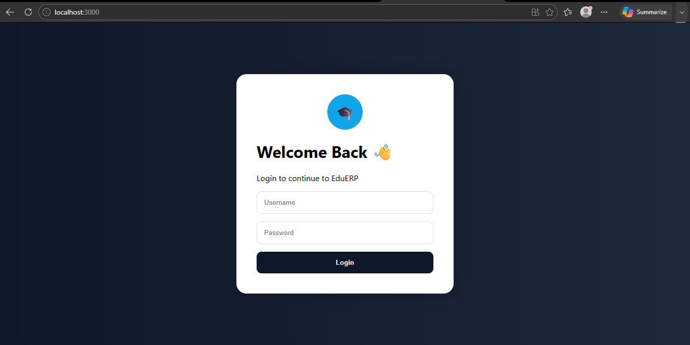

### Admin Dashboard
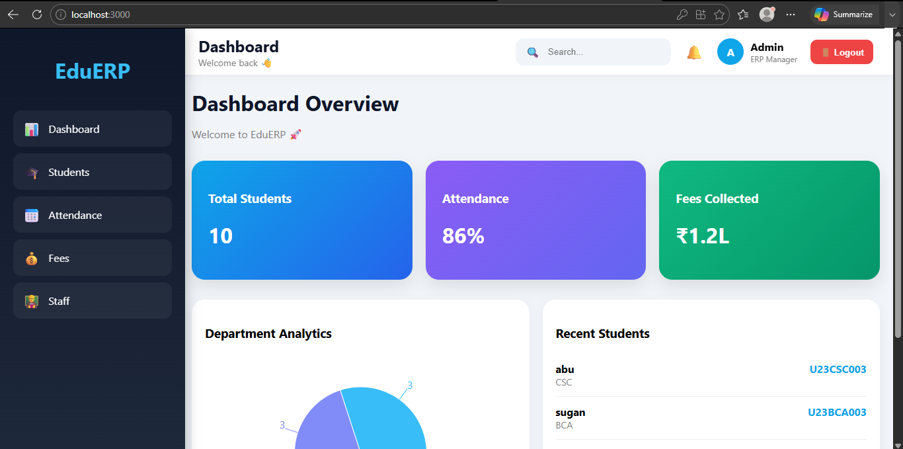

### Student Management
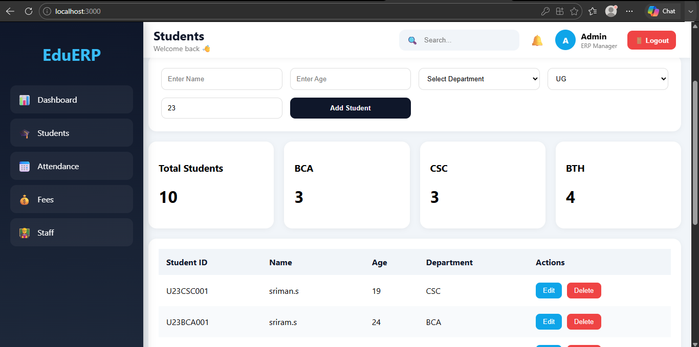

### Add Staff
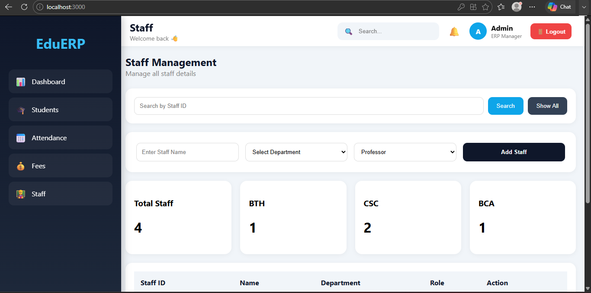

### Attendance Management
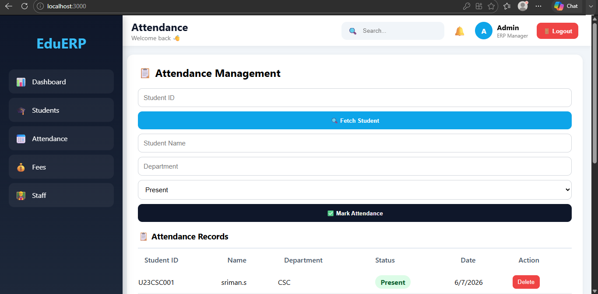

### Fees Management
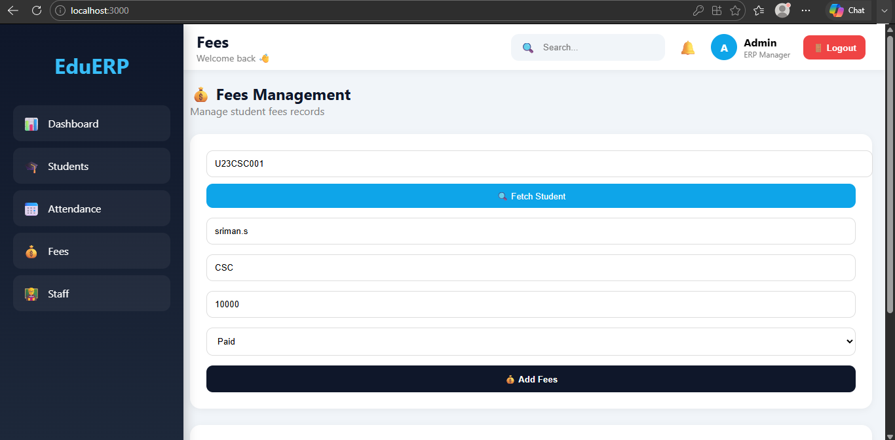

### Student Dashboard
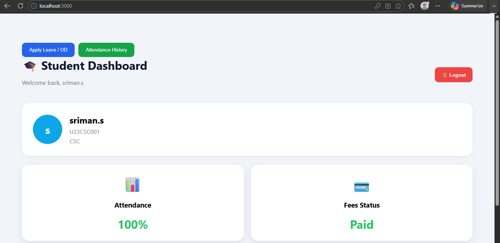

### Leave Request
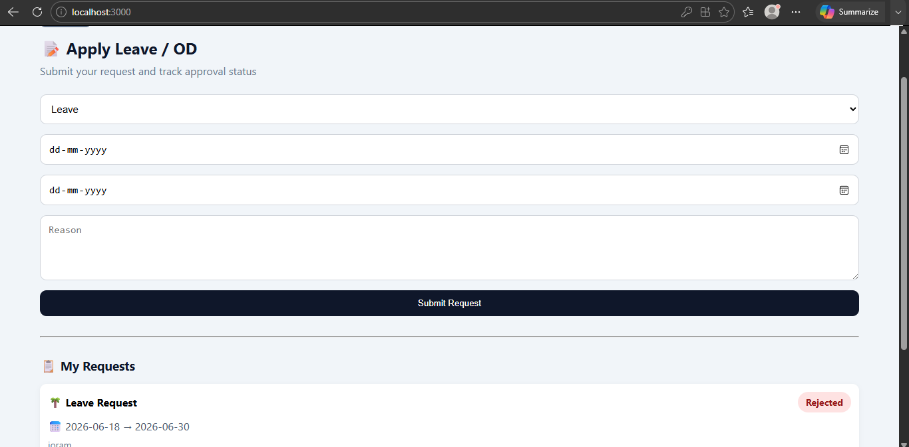

### Leave Approval
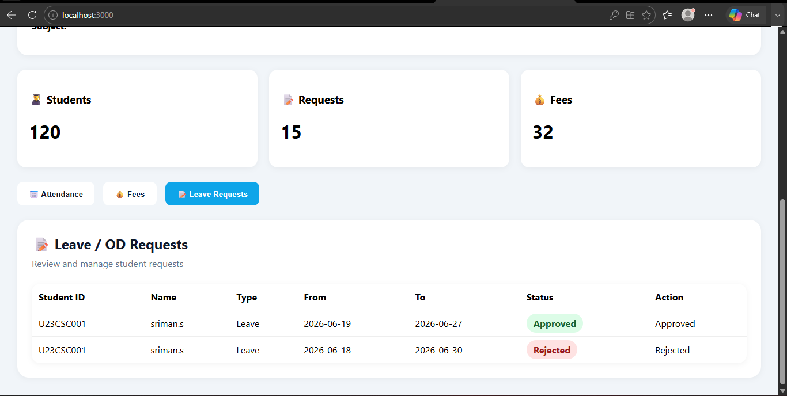

### Student Attendance History
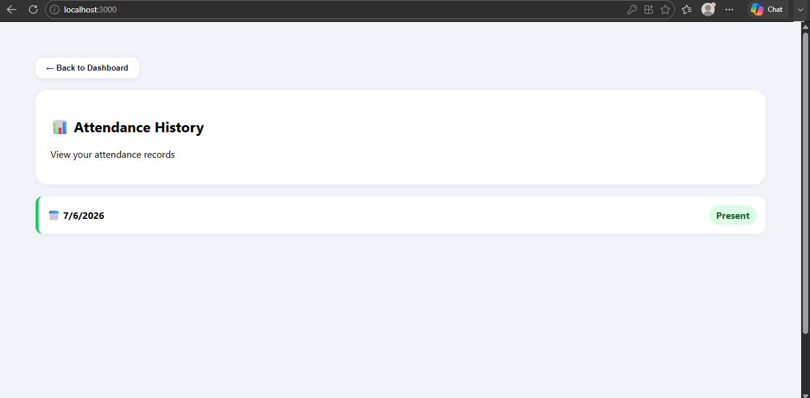

### Staff Attendance Management
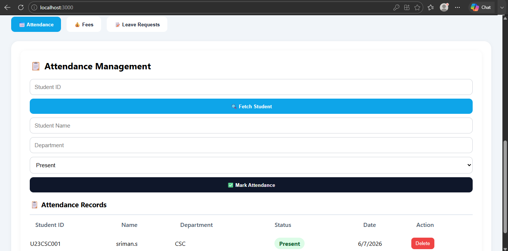

### Staff Fees Management
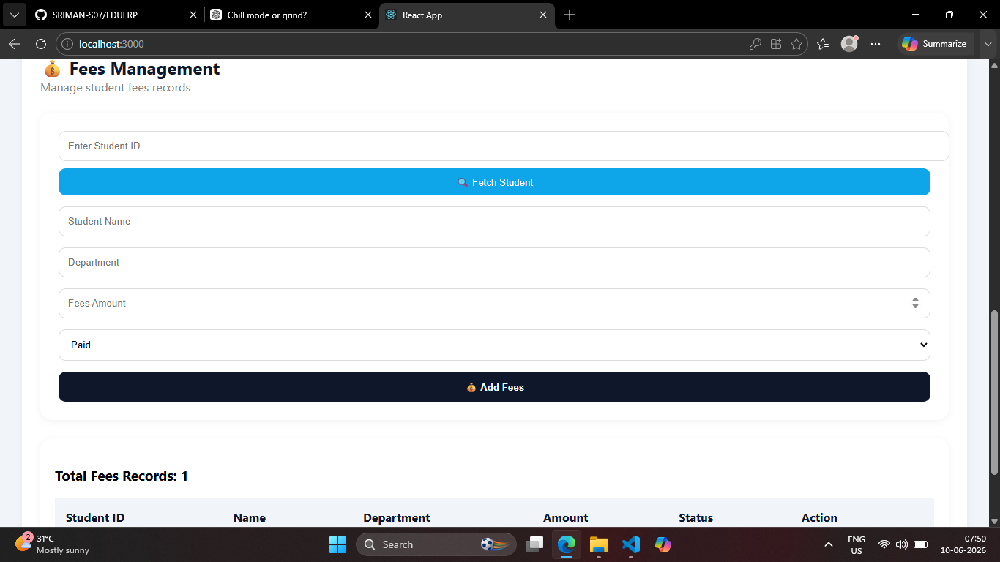

### Staff Dashboard
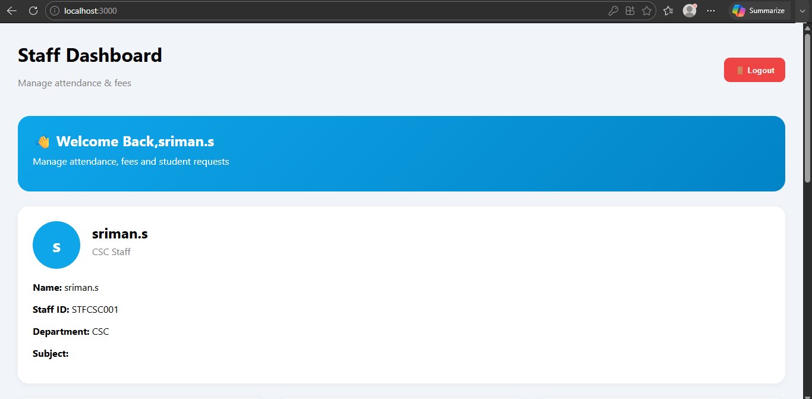
